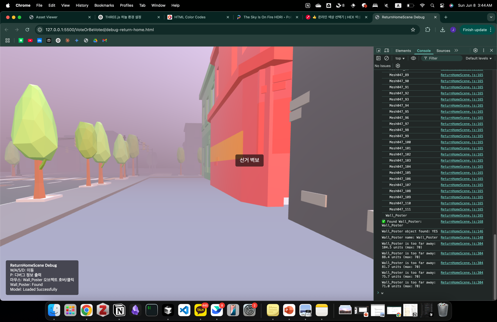
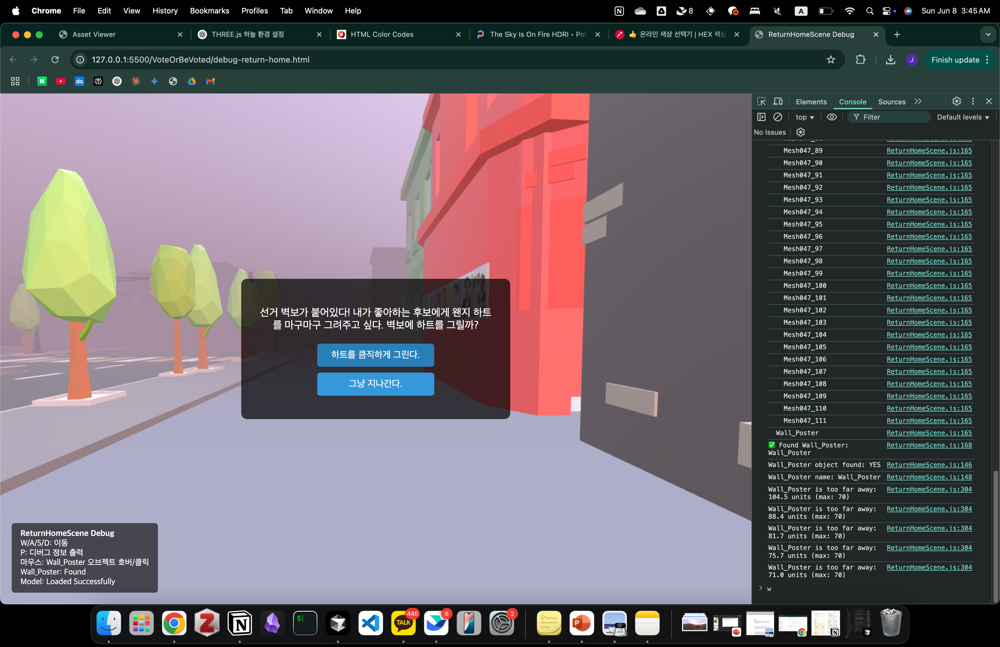

## 3D 모델 뷰어 `visualize.js`

<table>
<tr>
<td></td>
<td></td>
</tr>
</table>

### 기능 구현

- 3D 모델 로딩 및 표시 (GLB, FBX 형식 지원)
- 마우스로 모델 회전, 확대/축소, 이동 가능
- 오브젝트에 마우스를 올리면 오브젝트 이름 표시. -> interection 구현시 이름 확인 후 사용
- console 창에서 모든 object hierarchy 확인 가능!! 묶여있는 인터렉션 비활성화 object 빼고 인터렉션 가능 객체 확인

### 사용 방법

1. `visualize.js` 파일에서 `MODEL_PATH` 변수를 수정하여 원하는 3D 모델 파일 경로를 지정
   ```javascript
   const MODEL_PATH = '../assets/your-model.glb'; // 또는 .fbx 파일
   ```

### 컨트롤

- **마우스 왼쪽 버튼 드래그**: 모델 회전
- **마우스 오른쪽 버튼 드래그**: 모델 이동
- **마우스 휠**: 확대/축소
- **마우스 오버**: 오브젝트 이름 표시

---

## ReturnHomeScene `scripts/scenes/ReturnHomeScene.js`

<table>
<tr>
<td></td>
<td></td>
<td></td>
</tr>
</table>

선거 벽보와 상호작용 이벤트

### 기능 구현

- **3D 환경 렌더링**: `outdoor.glb` 모델 로딩 및 HDR 환경 조명 (`the_sky_is_on_fire_2k.hdr`)
- **1인칭 카메라 시스템**: WASD 이동 + 좌클릭 드래그 회전 (각도 제한 ±60°/±30°)
- **거리 기반 상호작용**: Wall_Poster 오브젝트와 70 units 이내에서만 상호작용 가능
- **시각적 피드백**: 마우스 호버 시 노란색 하이라이트 + "선거 벽보" 라벨 표시
- **스토리 분기**: 선택지 모달을 통한 SceneHome/SceneTVCount 씬 전환
- **안내 메시지**: 씬 진입 시 floating 메시지로 플레이어 가이드

### 사용 방법

1. **모델 파일 배치**: `assets/outdoor.glb` 파일이 올바른 경로에 있는지 확인
2. **HDR 텍스처**: `assets/textures/the_sky_is_on_fire_2k.hdr` 환경 맵 파일 필요
3. **Wall_Poster 오브젝트**: 3D 모델에 "Wall_Poster"라는 이름의 오브젝트 포함 필수

### 컨트롤

- **WASD**: 카메라 이동 (카메라 방향 기준)
- **좌클릭 + 드래그**: 카메라 회전 (수평 ±60°, 수직 ±30°)
- **마우스 호버**: Wall_Poster 하이라이트 (거리 70 units 이내)
- **좌클릭**: Wall_Poster 클릭 시 선택지 모달 팝업

### 게임플레이

1. 씬 시작 시 floating 메시지로 안내
2. WASD로 이동하여 선거 벽보에 접근
3. 충분히 가까워지면 마우스 호버로 하이라이트 확인
4. 클릭하여 선택지 모달 열기:
   - **"하트를 큼직하게 그린다"** → SceneHome으로 전환
   - **"그냥 지나간다"** → SceneTVCount로 전환

---

## 스타일시트 `styles/styles.css`

### 새로 추가된 클래스

#### `.floating-message`
씬 진입 시 표시되는 안내 메시지 스타일
- **위치**: 화면 중앙 고정 (`position: fixed`)
- **배경**: 반투명 검은색 + 블러 효과 (`backdrop-filter: blur(5px)`)
- **애니메이션**: 1초 페이드인 → 3초 유지 → 1초 페이드아웃
- **상호작용**: 비활성화 (`pointer-events: none`)

#### 애니메이션 키프레임
- **`floatingFadeIn`**: 아래에서 위로 나타나는 페이드인 효과
- **`floatingFadeOut`**: 위로 사라지는 페이드아웃 효과

### 기존 클래스 (유지)
- `.hover-label`: Wall_Poster 호버 시 표시되는 라벨
- `.choice-modal`: 선택지 팝업 모달
- `.choice-modal p`: 모달 내 텍스트 스타일
- `.choice-modal button`: 모달 내 버튼 스타일
